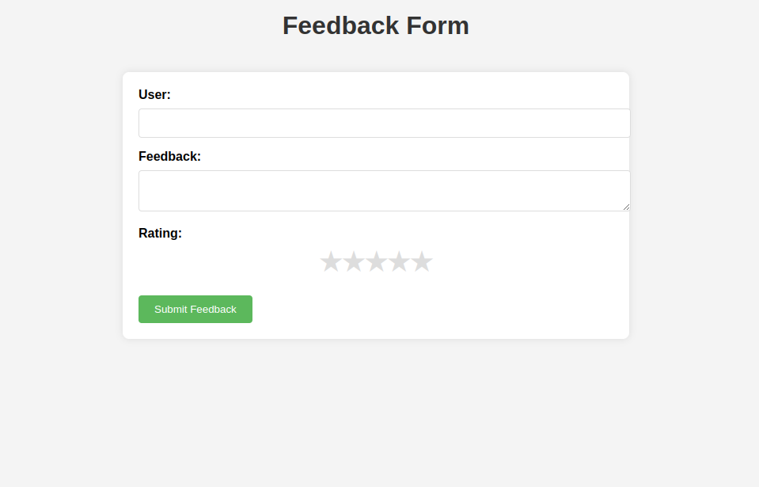
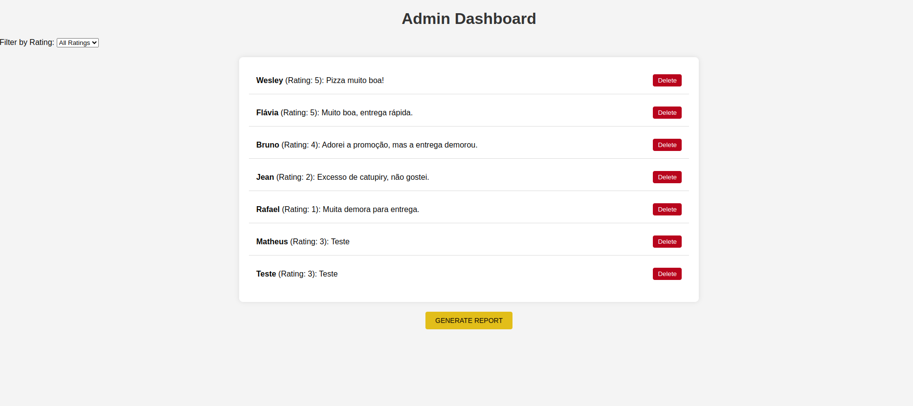

# Feedback Platform


## Description

**Feedback Platform** is a complete application that allows users to submit feedback and administrators to manage that feedback through an admin dashboard. The application was built using Go and Echo for the backend, SQLite as the database, and HTML, CSS, and JavaScript for the frontend.

## Features

- **Users** can:
  - Submit feedback.

- **Administrators** can:
  - View all feedback.
  - Filter feedback by rating.
  - Delete feedback.

## Technologies Used

### Backend

- **Go**: Programming language used to build the application's business logic.
- **Echo**: Web framework for Go, used to manage routes and middleware.
- **GORM**: ORM for Go, used to interact with the SQLite database.
- **SQLite**: Database used to store feedback.

### Frontend

- **HTML**: Used to structure the application's pages.
- **CSS**: Used to style the application's pages.
- **JavaScript**: Used to add interactivity to the application's pages.

### Tools

- **Postman**: Used to test the API routes.

## Project Structure

```plaintext
.
├── controllers
│   └── feedback.go
├── frontend
│   ├── assets
│   │   ├── css
│   │   │   └── styles.css
│   │   └── js
│   │       ├── admin.js
│   │       └── feedback.js
│   ├── admin.html
│   └── index.html
├── models
│   ├── feedback.go
│   └── setup.go
├── routes
│   └── routes.go
└── main.go
```

## Installation and Execution

### Prerequisites

- [Go](https://golang.org/doc/install)
- [Node.js](https://nodejs.org/) (to serve static files)
- C compiler (to use CGO)

### Steps

1. Clone the repository:

```sh
git clone https://github.com/WesleyBSa/feedback-platform.git
cd feedback-platform
```

2. Install dependencies:

```sh
go mod tidy
```

3. Compile and run the application:

```sh
set CGO_ENABLED=1
set CC=gcc
go build -o main -tags sqlite_omit_load_extension
./main
```

4. Access the application:

- Main page: `http://localhost:1313`
- Admin page: `http://localhost:1313/admin`

## Usage

### Submitting Feedback

On the main page, fill out the form with your name and feedback, and click "Submit Feedback."

### Managing Feedback

On the admin page, you can view feedback, filter feedback by rating, and delete feedback.

## Testing the API

Use Postman to test the API routes. Here are the available routes:

- `POST /feedbacks`: Creates new feedback.
- `GET /admin/feedbacks`: Returns all feedback.
- `GET /admin/feedbacks?rating=<rating>`: Returns feedback filtered by rating.
- `DELETE /admin/feedbacks/:id`: Deletes existing feedback.

## Screenshots

### Index Page



### Admin Page




## Contribution

Feel free to contribute to this project. To do so, follow the steps below:

1. Fork the repository.
2. Create a branch for your feature/bugfix: `git checkout -b my-feature`.
3. Commit your changes: `git commit -m 'Add some feature'`.
4. Push to the branch: `git push origin my-feature`.
5. Open a pull request.

## License

This project is licensed under the [MIT License](LICENSE).
```
